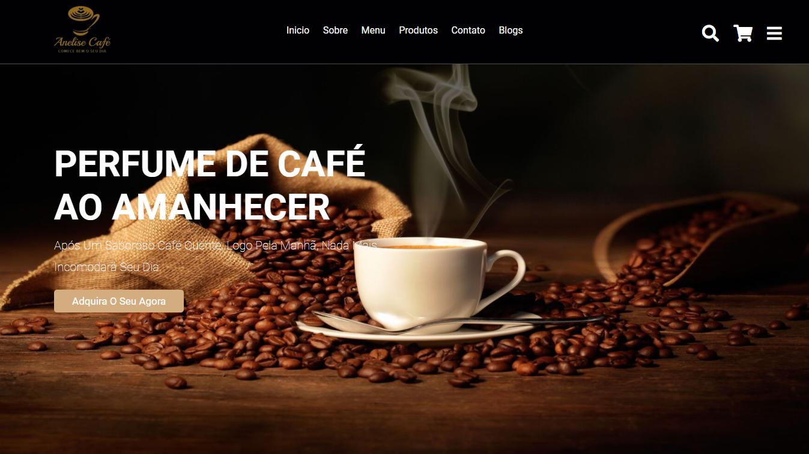

# Anelise Cafe Website

> Website of a coffee shop and sell products related, including blogs on the topic.

## 💻 Tecnologias utilizadas

## Ferramentas de desenvolvimento

  
  

## 🔗 Acesse o website

https://bit.ly/3cvjFqV

## 📝 Licença

Esse projeto está sob licença. Veja o arquivo [LICENÇA](LICENSE.md) para mais detalhes.

[⬆ Voltar ao topo](#anelise-cafe-website) 

